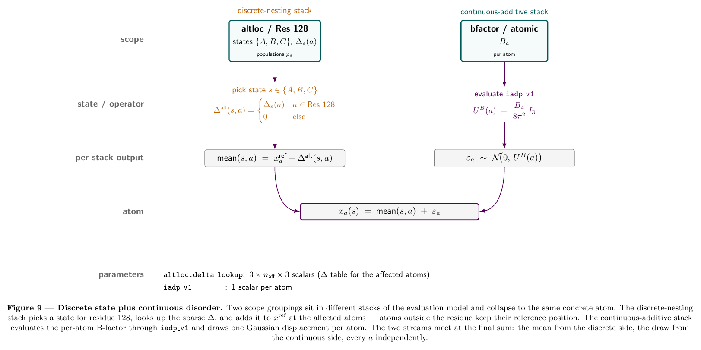
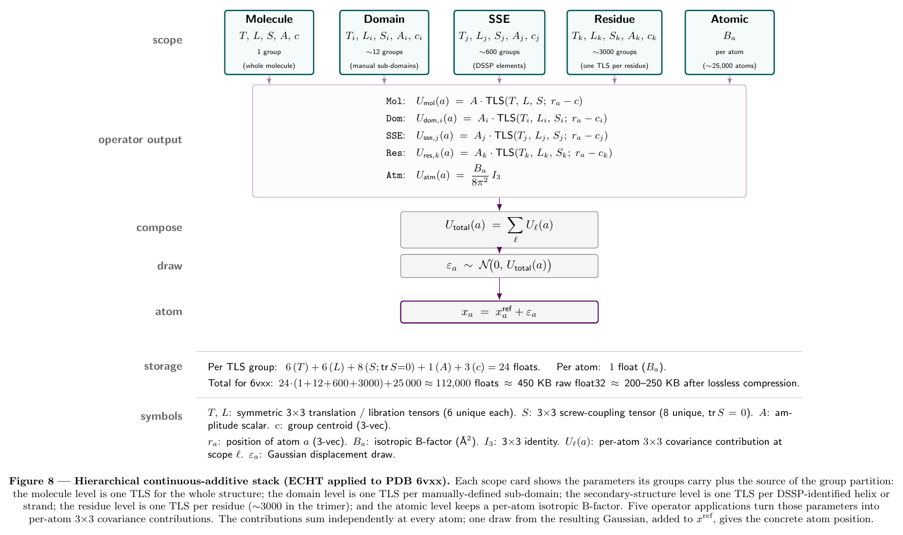







# 


The previous chapter described heterogeneity in isolation: a regime, a scope, a materialization mode. Real depositions almost never have just one descriptor. A refined crystal carries B-factors, altlocs, and often TLS groups simultaneously; an NMR bundle carries an ensemble of models plus per-atom uncertainty estimates; an MD trajectory frequently carries a per-frame state-cluster label alongside the coordinates. This chapter is about how multiple scope-local descriptors coexist in the same file, how the assumptions about their coupling let storage stay linear in the sum of per-scope state spaces rather than blowing up to the product, and what operational contract the format has to satisfy to actually render coordinates from the resulting tangle. The IR can be specified mostly by writing down a Zarr layout; the *evaluation model* is what gives that layout a meaning.

## Realistic mixing scenarios

{fig-alt="A two-chain complex with a bound ligand: Chain A is plain containment, Chain B carries a Regime 3 hinge motion plus a Regime 1 rotamer ensemble at one residue, and the ligand is a Regime 2 trajectory."}

Before introducing the formal composition rule, it is worth grounding the discussion in cases that actually exist on disk today, ordered roughly from most to least common:

1. **Refined crystal structure with B-factors, altlocs, and optionally TLS.** Most of the PDB. Three descriptors at three scopes (atom, residue, chain or domain), all currently encoded in three unrelated mmCIF conventions.
2. **NMR bundle with per-model uncertainty.** A discrete ensemble at assembly scope plus a parametric atom-scope descriptor. Two layers, cleanly aligned on the model axis.
3. **MD trajectory with a per-frame state-cluster label.** A Regime 2 trajectory at assembly scope plus a Regime 1 discrete label per frame, sharing the frame axis. The label is a function of the trajectory; this is a provenance link, not a state-space restriction.
4. **qFit-style multiconformer ensemble.** Regime 1 at residue scope, sparsely distributed, plus the standard atom-scope B-factors.
5. **Cryo-EM with a discrete class assignment plus a continuous within-class motion.** Two layers at the same scope (assembly), one Regime 1 and one Regime 3, with the continuous mode commonly nested under the class label.

The combinatorial multi-scale ribosome and cryo-ET workflows that earlier drafts of this chapter led with are real as capability targets but not as current practice; they belong as scaling demonstrations later, not as the motivating cases. The design slogan is "support some modes of heterogeneity some of the time" out of the box, with the structure to evolve toward more.

## What an evaluation model is

The architecture chapter is about the *intermediate representation*: what a deposition contains, schema and bytes. The evaluation model is the contract that turns those bytes into rendered coordinates -- it is the operational semantics of the four-layer IR. Concretely, it has to specify:

- For every (regime, mode) combination, the procedure that produces a per-atom displacement contribution from a descriptor's stored payload and its state input.
- An operator interface that every Mode C subcase satisfies, with declared input/output shapes and reference frames.
- The order of operations when descriptors don't commute (rotations don't).
- How descriptors at different scopes compose, dispatched on a small enumerated set of composition algebras.
- How sample-aligned descriptors are co-iterated, and how broadcast descriptors are evaluated within an aligned-axis walk.

This is the harder half of the design. The static schema is mostly a discipline question; the evaluation model is the design problem.

## Extension surfaces {#extension-surfaces}

The evaluation model has two pluggable extension points.

The first is a **typed-operator system**. Every operator declares a *type* -- an interface (input/output shapes, frames; pinned down for the four current types in the [Mode C operator interfaces](#mode-c-operator-interfaces) section), the [Mode C subcase](02-architecture.qmd#materialization) it satisfies, and a composition-rule tag -- and stores its *body* in one of three venues, picked per-deposition:

- **Inline** in the deposition for bespoke implementations the deposition cannot recover from a shared spec. Examples: a trained cryoDRGN decoder checkpoint specific to this cryo-EM dataset; a per-deposition PCA basis fit on this protein only; a learned neural potential trained for a particular structure-prediction model; ad-hoc lookup tables; diffusion-sampled posterior ensembles produced by a one-shot model run; a custom attention-based decoder for this protein family; deposition-specific radiation-damage or beam-induced-motion correction operators; a per-deposition fitted Gaussian mixture model over latent space; density-modification operators tuned to a specific map. The body lives next to the inputs in the same file. The deposition is self-contained.

- **Registry-referenced** by content hash for *standardized* operators whose body is recoverable from a stable spec. Examples: TLS evaluation (`parametric_gaussian/tls_v1`); isotropic ADP scaling (`parametric_gaussian/iadp_v1`); anisotropic ADP (`parametric_gaussian/aadp_v1`); classical normal-mode evaluation over a stored basis (`basis/nm_v1`); rigid-body transform application via quaternion plus translation (`rigid_body/quat_v1`); standard PCA reconstruction; occupancy-weighted averaging; standard symmetry transforms (P1, P21, ...); identity / no-op. These are small, spec-defined, often a few lines of NumPy. The body is the same across every deposition that uses TLS, so duplicating it in every entry would be wasted bytes; the deposition pins by content hash, and anyone can re-implement against the spec and verify the hash matches.

- **External-artifact-referenced** by URI plus content hash for payloads too large to inline. Examples: an MD trajectory in H5MD on EMPIAR or institutional storage; a multi-million-frame cryo-EM particle stack; a long-simulation energy surface; a community foundation model for protein dynamics hosted on Zenodo or HuggingFace; a precomputed feature cache shared across many depositions; raw experimental data (diffraction images, micrograph movies); large alignment files; reference homology structures. Inlining is not just impractical here, it is infeasible -- the artifact is bigger than every consumer's working set.

The deposition principle is to **prefer self-containment when feasible**. Inline by default for anything bespoke; registry-reference for spec-stable operators where the body is recoverable from the spec; external-artifact reference only when inlining is genuinely impossible. The operator's type is what consumers dispatch on; the body's storage venue is an orthogonal choice. This is what earlier drafts of the architecture chapter called the "operator graph" -- not a per-deposition object, but the format's open-ended extension surface for "what kinds of computation can a Mode C descriptor invoke, and where its implementation lives."

The second is a **small enumerated set of composition algebras** -- the rules for how descriptors at different scopes combine when more than one applies to the same atom. Today the format needs four:

- **Independence** (default): joint distribution factors; descriptors are evaluated independently. The atom-level B-factors of a refined crystal across atoms.
- **Hierarchical nesting** (`nested_under`): the state space of a child-scope descriptor is conditional on the parent-scope descriptor; storage scales with the legal-state count rather than the Cartesian product.
- **Additive in covariance space**: parametric-Gaussian descriptors at different scopes combine by summing per-atom $3 \times 3$ covariances.
- **Additive in displacement space**: deterministic-displacement descriptors (basis, decoder, external reference) at different scopes sum per-atom 3-vectors directly into the mean.

Every operator in the registry is tagged with which algebra it composes under. The discrete-nesting and continuous-additive stacks of the next section are the worked-out instances of two of these four. A future descriptor type that fits none of them declares a new algebra; the format has to learn to dispatch on it, but the addition is small and named, not a structural change. Operators are open-ended; algebras are a small enumerated set.

## The composition principle: two parallel stacks

{fig-alt="Two scope groupings sit in different stacks: the discrete-nesting stack picks an altloc state and looks up a sparse delta; the continuous-additive stack draws a Gaussian from per-atom B-factor covariances; the two streams meet at a single concrete atom equation."}

::: {.def data-term="Reference structure"}
$x^{\mathrm{ref}}$ is the single anchor: a per-atom Cartesian position, one set, in $\mathbb{R}^3$. It is what the deposition would render as if every heterogeneity descriptor were inactive. Every descriptor's contribution is expressed as a displacement against it.
:::

The earlier draft of this chapter used a single sum over scopes that conflated two physically and mathematically different composition rules. They behave differently and they should be split:

$$
x_i(s_{\mathrm{disc}}, s_{\mathrm{cont}}) \;=\; \mathrm{mean}_i(s_{\mathrm{disc}}) \;+\; \delta_i(s_{\mathrm{cont}})
$$

- $\mathrm{mean}_i(s_{\mathrm{disc}})$ is the *mean structure* for atom $i$ given the discrete-state assignment $s_{\mathrm{disc}}$, resolved by **hierarchical state-space nesting** through the discrete descriptors.
- $\delta_i(s_{\mathrm{cont}})$ is the *displacement* contributed at atom $i$ by the continuous Gaussian descriptors at every scope it belongs to, resolved by **additive composition in covariance / displacement space**.

Discrete states determine which mean structure is being described. Continuous Gaussian descriptors describe thermal disorder around whatever mean was selected. The two stacks act on different aspects of the structure and do not interfere with each other.

### The discrete-nesting stack

::: {.def data-term="Discrete-nesting stack"}
The composition rule for Regime 1 descriptors at multiple scopes. Each child descriptor declares which parent state activates which child state set; only legal joint states exist at render time. Storage scales with the count of legal joint states, not the Cartesian product of per-scope state spaces.
:::

Discrete (Regime 1) descriptors at multiple scopes compose by state-space restriction. Each child descriptor declares which parent state activates which child state set, and only legal joint states exist at render time. The canonical published instance is Wankowicz & Fraser's hierarchical compositional/conformational nesting [@wankowicz2024encoding]: compositional state at entity-instance scope (ligand bound vs absent), conformational state at residue-range scope (loop conformations available given ligand state), rotamer state at residue scope (sidechain conformers conditional on loop state). qFit-ligand [@flowers2025qfit] implements this pattern in a working ligand-modeling pipeline.

Each level produces, conditional on its parent's state, a *displacement from $x^{\mathrm{ref}}$* (or a stored coordinate set, depending on Materialization mode). The composition for the discrete stack at atom $i$ is

$$
\mathrm{mean}_i(s_{\mathrm{disc}}) \;=\; x_i^{\mathrm{ref}} \;+\; \sum_{\ell \in \mathrm{disc\ scopes}} \Delta_i^\ell\bigl(s_\ell \mid s_{\mathrm{parent}(\ell)}\bigr).
$$

Storage scales with the number of *legal* joint states, not the Cartesian product of per-scope state spaces. The acceptable parametric forms at any scope are open: altloc-style multiconformer, qFit ensembles, cryo-EM 3D classification labels, named cluster assignments, compositional flags, ligand binding modes -- any of these slot in. The composition rule cares about the conditional-state-set relationship between parent and child, not how each scope's discrete state was assigned.

### The continuous-additive stack

{fig-alt="ECHT applied to PDB 6vxx: five scope levels (molecule, domain, SSE, residue, atom) each carry TLS or B-factor parameters; per-level operators produce per-atom 3x3 covariance contributions which sum independently before a single Gaussian draw is added to the reference position."}

::: {.def data-term="Continuous-additive stack"}
The composition rule for Regime 3 Gaussian descriptors at multiple scopes. Each level contributes a per-atom $3 \times 3$ covariance; the total atomic displacement covariance is the *sum* of those contributions, under the assumption that levels are uncorrelated. ECHT [@pearce2021echt] is the published instance.
:::

Continuous Regime 3 descriptors at multiple scopes that each describe distributed Gaussian variation -- thermal disorder, in particular -- compose by *adding their covariances at each atom*. Whole-molecule rocking, domain libration, secondary-structure breathing, per-atom local jitter: each at its own scope, each a parametric Gaussian, all summing linearly to give the total atomic displacement covariance. The composition for the continuous stack is

$$
U_{\mathrm{total}}(i) \;=\; \sum_{\ell \in \mathrm{cont\ scopes}} U^\ell\bigl(\text{params}_\ell, x_i^{\mathrm{ref}}\bigr),
$$

where $U^\ell(\cdot)$ is the per-atom $3 \times 3$ anisotropic covariance contributed at level $\ell$. Sampling produces displacements drawn from $\mathcal{N}(0, U_{\mathrm{total}})$. The mathematical assumption is that contributions at different levels are uncorrelated.

The published precedent is ECHT -- Extensible-Component Hierarchical TLS -- from Pearce & Gros 2021 [@pearce2021echt] and its ensemble-refinement extension [@ploscariu2021ensemble]. ECHT instantiates the continuous-additive stack with TLS at every level (whole molecule at the bottom, domains and secondary-structure elements in the middle, per-atom ADPs at the top), but the composition rule is general. Acceptable parametric forms at any level include TLS, anisotropic network models, normal-mode bases (linear or learned), Gaussian processes over atoms, anisotropic per-atom ADPs, isotropic per-atom B-factors -- the format does not need to know which.

A refined TLS block is worth dwelling on because the way it composes is easy to misread. It is not a deterministic transform applied to a reference structure; it parametrizes a Gaussian distribution over rigid-body poses of the group. The per-atom contribution it produces is therefore an anisotropic Gaussian covariance, not a single vector. Sampling produces a draw; taking the mean produces zero; the second moment is the propagated covariance. When TLS coexists with per-atom B-factors, both describe Gaussian thermal motion and they sum -- not as draws but as covariances -- to give the total $U$.

### Where Materialization fits

The materialization mode is per-scope and per-stack. A chain-scope continuous TLS descriptor is stored as parameters ([Mode C](02-architecture.qmd#materialization)). A residue-scope discrete altloc is stored as sparse deltas ([Mode B](02-architecture.qmd#materialization)). A few named system-wide snapshots can be stored as full enumerations ([Mode A](02-architecture.qmd#materialization)). Composition happens at render time, not at store time. The regime chosen at one scope does not constrain the regime at any other scope: a chain-level continuous descriptor and a residue-level discrete descriptor coexist without friction precisely because they live in different stacks.

### Underdetermination of the continuous decomposition

A property of the continuous-additive stack worth flagging explicitly. With multiple Gaussian levels, the experimental data only constrains the *sum* of covariances across levels; the distribution of motion across levels is determined by the fitting procedure, not by the data. Two depositors looking at the same crystal can produce different valid decompositions that differ only in how they pushed motion up or down the hierarchy. ECHT uses an elastic-net penalty to break this underdetermination and enforce parsimony (assign disorder to the largest scale that can explain it); a different regularizer would distribute the same total disorder differently. This is analogous to two compilers producing different but valid optimized assembly from the same source program -- both faithful, both legitimate.

The format does not need to legislate the regularizer. It does need to record per-descriptor *fitting provenance* so a downstream consumer can know they are reading "this protein decomposed by ECHT with elastic-net $\lambda = 0.3$" rather than an unattributed pile of TLS blocks. This lands in the existing annotation/provenance slots from [chapter 4](04-annotations-and-engine.qmd#query-language-and-annotations); it does not require new architectural machinery.

## Independence, nesting, and provenance

Heterogeneity descriptors at different scopes are either **independent** or **hierarchically nested**. Both structures keep storage linear in the sum of per-scope state spaces. A third relationship -- **provenance** -- connects descriptors that are not coupled in the state-space sense but where one was *computed from* another; it has no consequences for legal joint states but it does change what the format needs to store and how a consumer reads it.

**Independence.** The joint distribution factors: $p(s) = \prod_\ell p(s_\ell)$. The chain-level TLS parameters, residue-level altlocs, and atom-level B-factors of a typical crystal are usually treated as independent, which is exactly how crystallographic refinement produces them.

**Hierarchical nesting.** The state space of a child-scope descriptor is conditional on the parent-scope descriptor. The canonical case is compositional-ligand $\supset$ conformational-loop nesting: when the ligand is bound (compositional state $X$), the loop can take conformations $\{A, B\}$; when the ligand is absent (compositional state $Y$), the loop takes conformation $\{C\}$ only. The child descriptor carries a pointer to the parent state that activates it, and invalid combinations are rejected at render time. This is a restricted Cartesian product -- a DAG of (scope, state) nodes with edges encoding which parent-child combinations are legal. The edge type is `nested_under`.

**Provenance link.** Descriptor $B$ was computed as a function of descriptor $A$. The MSM-derived state-cluster labels for an MD trajectory are a function of the trajectory; the cryo-EM functional-state class labels are a function of the cryoDRGN latent. These are not state-space restrictions -- the joint $(A, B)$ space is the same as $A$ alone, because $B$ is determined by $A$. The edge type is `derived_from`, and it records the function (or a reference to the producing pipeline) that mapped $A$ to $B$. The on-disk consequence: if the function is cheap and reproducible, $B$ might not need to be stored at all.

The independence-or-nesting assumption is what keeps storage scaling with the sum, not the product, of scope state spaces. Without it, the format has to fall back on storing full Cartesian state tables, which is [Heterogeneity Regime 1: Discrete Ensemble](02-architecture.qmd#heterogeneity) at the whole-system scope and defeats the point of scoping descriptors.

## Sample axes: aligned, broadcast, mixed

::: {.def data-term="Sample axes"}
A descriptor's *sample axis* is the index along which the deposition stores its multiple samples (frames, models, particles, latent draws). Descriptors are **aligned** when they share a named sample axis (sample $i$ of one corresponds to sample $i$ of another), **broadcast** when they have no sample axis at all (the descriptor is parametric and renders by drawing on demand), and **mixed** when a deposition combines an aligned core with one or more broadcast satellites.
:::

The composition formula talks about a state tuple $s$, but says nothing about how those entries are stored when the deposition has many "samples". Two patterns recur and have radically different on-disk consequences.

**Aligned.** Multiple descriptors share a sample axis. Sample $i$ corresponds to coordinated values across descriptors. The cleanest case is a trajectory plus a per-frame state-cluster label: the trajectory has a frame axis, the label has a frame axis, frame 47 has both a coordinate set and a class label that go together because they were computed on the same frame. On disk this is naturally a Zarr group with multiple arrays sharing a leading axis chunked together.

**Broadcast.** A descriptor is parametric -- it has no sample axis. The deposition describes a probability distribution over conformations, and "sampling" only happens at render time when a consumer asks for a draw. Refined crystallographic structures with TLS, altlocs, and B-factors are pure broadcast: nothing in the file has a sample dimension; renders are independent draws across descriptors.

**Mixed.** A deposition has both an aligned core and broadcast satellites. A consumer iterating the aligned axis sees the broadcast descriptors freshly evaluated at each step.

Every descriptor should declare two things in its metadata:

1. Whether it has a sample axis or is parametric.
2. If it has a sample axis, which named axis (`frame`, `model`, `particle`, ...). Descriptors sharing an axis name are aligned by index on that axis.

This produces a small graph of "shared sample axes" alongside the scope DAG, and the on-disk Zarr structure follows directly from it: just axis names and a parametric flag. It covers the realistic cases.

## Per-descriptor reference points

The composition formula assumes a single global $x^{\mathrm{ref}}$, but descriptors are fit against whatever structure was natural at fit time. Within a single experiment the references usually agree by construction -- a normal-mode basis fit on the deposition's reference trivially does -- but if a Mode C generative descriptor was fit against a slightly different reference (a higher-resolution local refinement, a consensus before symmetry expansion), there is a constant offset that has to be tracked.

The fix is a single metadata field per descriptor: an offset that the evaluation model adds when composing. Realistic cases are mundane (same lab, same study, slightly different "preferred" reference structures across processing steps), so this is a one-line note rather than an architectural change. Cross-experiment reference reconciliation -- "your refined crystal plus my cryoDRGN decoder of the same protein from a different study" -- is not a current workflow and is not what this field is meant to solve.

## A note on the older "residual" framing

Earlier drafts of this chapter described the per-atom B-factor in standard TLS+atomic refinement as "the residual against TLS." This is how the historical Winn-Murshudov 2001 framing introduces it [@winn2001tls; @painter2006tlsmd; @urzhumtsev2013adp] and how it is implemented operationally in REFMAC, TLSMD, and phenix.refine. It is also the wrong primitive for this format.

The cleaner framing is the additive-Gaussian one above. There is no asymmetric "residual" relationship between levels; all contributions are independent Gaussians, all sum linearly in covariance space, none is more fundamental than the others. The reason the per-atom term ends up looking like "what is left over after TLS" is not structural -- it is a *fitting-time* outcome of whatever regularizer the refinement procedure used. ECHT's elastic-net penalty enforces parsimony, which is why TLS at higher scopes "absorbs" disorder that would otherwise show up in atomic ADPs; a different regularizer would push the same total disorder around differently. The compositional algebra is purely additive in covariance space, and the format stores the resulting parameter values without needing a "residual against parent" structural primitive.

This is also why software that is unaware of TLS gets the wrong answer when it reads only the per-atom B-factor column: it is reading one term of an additive sum and treating it as the total. The fix at the format level is the same either way -- record every contributing descriptor and let the consumer sum them -- but it is now a one-rule consequence of additive composition rather than a special asymmetric relationship that needed its own metadata field.

## Mode C operator interfaces {#mode-c-operator-interfaces}

::: {.def data-term="Operator interface"}
The contract every Mode C subcase satisfies: a function with the shape `(state_input, reference) -> displacement`, plus declared input shape, output shape, atom-id ordering, and reference frame. Parametric Gaussians, basis descriptors, neural decoders, and external references all fit this surface; they differ in what `state_input` is, what backend the call lands on, and whether the output is a draw or a distribution.
:::

Each [Mode C subcase](02-architecture.qmd#materialization) needs its own operator contract. The four contracts side by side:

```
ParametricGaussian:                          # TLS, anisotropic ADP, NM-derived covariance
  params:        ndarray                       # TLS: (20,);  aniso ADP: (N_atom, 6); iso B: (N_atom,)
  state_input:   "mean" | int                  # sample index, or mean-only (deterministic zero)
  reference:     ndarray (N_atom, 3)           # x_ref
  output:        ndarray (N_atom, 3, 3)        # per-atom 3x3 covariance contribution
  frame:         x_ref frame
  composition:   covariance addition across scopes (continuous-additive stack)

Basis:                                       # normal modes, PCA
  basis:         ndarray (k, N_atom, 3)
  coeffs:        ndarray (k,)                  # state input
  output:        ndarray (N_atom, 3)           # deterministic displacement
  frame:         declared per-basis

NeuralDecoder:                               # cryoDRGN-style
  checkpoint:    artifact_ref                  # TorchScript blob or training checkpoint
  latent:        ndarray (d,)                  # state input
  output:        ndarray (N_atom, 3)           # displacement (or absolute coords minus x_ref)
  frame:         declared per-checkpoint

ExternalReference:                           # H5MD trajectory, particle stack
  artifact:      uri + content_hash
  key:           int | str                     # frame index, particle id
  output:        ndarray (N_atom, 3)           # coordinate set
  frame:         declared per-artifact, with alignment to x_ref
```

The common surface across all four is `(state_input, reference) -> displacement`. The differences are in what `state_input` looks like, what backend the call lands on, and whether the output is a draw, a distribution, or a deterministic vector.

Two subcase asymmetries are worth making explicit. First, `ParametricGaussian` returns a *covariance*, not a displacement -- composition with other parametric-Gaussian descriptors at different scopes is by [covariance addition](#the-continuous-additive-stack), and when the consumer asks for a draw the evaluation model sums covariances across contributing scopes first and samples once from the resulting per-atom $\mathcal{N}(0, U_{\mathrm{total}})$, not once per descriptor. Second, `NeuralDecoder` may emit absolute coordinates rather than displacements depending on the network's output convention; the evaluation model normalizes to displacement by subtracting $x^{\mathrm{ref}}$ on read.

## Cross-backend integration

Producing a single rendered snapshot from a realistic deposition can require reads against several backends simultaneously: $x^{\mathrm{ref}}$ from a Zarr array (CPU/NumPy), sparse altloc deltas from an Arrow-backed Mode B store, a TorchScript decoder running on GPU for a Mode C learned descriptor, an external HDF5 trajectory seek, and a parametric TLS block evaluated in NumPy. The composition formula assumes all five land as commensurable displacement vectors that add. The evaluation model has to specify what binds them: a render driver that knows how to schedule the calls across backends without forcing every consumer to reinvent it.

```python
def render_snapshot(deposition, joint_state, rng):
    x_ref = read_zarr(deposition.x_ref)                       # Zarr / NumPy

    # Discrete-nesting stack: build the mean structure for this joint state
    mean = x_ref.copy()
    for scope, state in joint_state:                          # legal joint state from scope DAG
        delta = read_arrow_deltas(deposition, scope, state)   # Arrow / Mode B
        mean[delta.atom_id] += delta.xyz                      # or: replace, if Mode A

    # Continuous-additive stack: per-atom covariance, plus deterministic-displacement subcases
    U_total = zeros((N_atom, 3, 3))
    for desc in deposition.continuous_descriptors:
        if desc.kind == "parametric_gaussian":
            U_total += eval_param_gaussian(desc, x_ref)       # NumPy
        elif desc.kind == "basis":
            mean += eval_basis(desc, desc.coeffs)             # deterministic displacement
        elif desc.kind == "neural_decoder":
            mean += run_decoder(desc, desc.latent,            # TorchScript / GPU
                                device="cuda")
        elif desc.kind == "external_reference":
            mean = read_hdf5_frame(desc.uri, desc.key)        # HDF5 seek; replaces mean

    draw = sample_gaussian_per_atom(U_total, rng)             # one draw per atom from N(0, U_total)
    return mean + draw
```

Two things are worth pointing at in this driver. First, sampling from the continuous-additive stack happens *once*, after all parametric-Gaussian contributions have been summed -- not once per descriptor. Second, the deterministic-displacement Mode C subcases (basis, decoder) compose into `mean`, not into `U_total`; an external reference is the one subcase that *replaces* `mean` rather than adding to it (the artifact carries absolute coordinates).

Most implementation effort will go here. The static schema is mostly a discipline question; this is an engineering one, and every "open question" later in this chapter is, more or less, a hole in this driver.

## Worked example: ECHT decomposition of the SARS-CoV-2 spike (6vxx)

::: {.example}

@pearce2021echt fits an Extensible-Component Hierarchical TLS model to the SARS-CoV-2 spike trimer in the closed conformation (PDB 6vxx, 2.8 Å, refined with one isotropic ADP per atom). The decomposition produces five levels of disorder -- molecule, domain, secondary-structure element, residue, atomic -- composing additively at each atom under the rule of equation (2) of the paper:

$$
\mathbf{U}^{\text{total}}_a \;=\; \sum_{l=1}^{n_{\text{tls}}} \mathbf{U}^{\text{tls}}_{l,a} \;+\; \mathbf{U}^{\text{atomic}}_a.
$$

::: {.figure-placeholder}
*Figure 8 (forthcoming) — hierarchical continuous-additive stack visualizing the five scope groupings, per-scope operator applications, and the compose / draw / atom cascade. Symbol legend and storage breakdown at the bottom.*
:::

Reading 6vxx into our format produces the following.

### What goes into the Groupings layer

Each ECHT level is one typed grouping. Five total, all with `kind: heterogeneity_descriptor.scope`, all unweighted bipartite membership tables.

```
groupings/echt.molecule/v1
  kind:        heterogeneity_descriptor.scope
  members:     1 group; all heavy atoms of the trimer
  attachments: operator_ref → parametric_gaussian/tls_v1
               composition  → additive_covariance

groupings/echt.domain/v1
  kind:        heterogeneity_descriptor.scope
  members:     ~12 groups (4-5 sub-domains × 3 protomers);
               domains manually defined per Pearce & Gros Supp. Fig. 11
  attachments: operator_ref → parametric_gaussian/tls_v1
               composition  → additive_covariance

groupings/echt.secondary_structure/v1
  kind:        heterogeneity_descriptor.scope
  members:     ~600 groups; auto-identified from DSSP via cctbx
  attachments: operator_ref → parametric_gaussian/tls_v1
               composition  → additive_covariance

groupings/echt.residue/v1
  kind:        heterogeneity_descriptor.scope
  members:     ~3000 groups; one per residue (excl. Gly/Ala/Pro per ECHT)
  attachments: operator_ref → parametric_gaussian/tls_v1
               composition  → additive_covariance

groupings/echt.atomic/v1
  kind:        heterogeneity_descriptor.scope
  members:     ~25 000 singletons; one per heavy atom
  attachments: operator_ref → parametric_gaussian/iadp_v1
               composition  → additive_covariance
```

These five groupings cover the same atoms at five different granularities. Their member sets overlap completely (every atom appears in every level), but the partition structure differs -- one giant group at molecule level, ~12 disjoint groups at domain level, and so on down to singletons at atomic level.

### What the scope DAG looks like

Five broadcast (parametric, no sample axis) nodes, all parallel -- none nested under another -- all tagged with the `additive_covariance` composition algebra. No `nested_under` edges, no `derived_from` edges. The scope DAG for an ECHT deposition is flat:

```
nodes:
  (echt.molecule,                tls_params_1)        broadcast, additive_covariance
  (echt.domain[i],               tls_params_per_i)    broadcast, additive_covariance
  (echt.secondary_structure[j],  tls_params_per_j)    broadcast, additive_covariance
  (echt.residue[k],              tls_params_per_k)    broadcast, additive_covariance
  (echt.atomic[a],               B_per_a)             broadcast, additive_covariance

edges: none
```

This is the format's pure-continuous-additive case -- no discrete states, no nesting, no sample axis. 6vxx has no altloc, no compositional disorder, no discrete heterogeneity. The discrete-nesting stack is empty; the continuous-additive stack carries everything.

### What the Materialization layer stores per group

Mode C, parametric Gaussian (TLS subcase) for the four TLS levels, parametric Gaussian (i-ADP subcase) for the atomic level. Per ECHT's parameterization (paper eqs. 7-9):

```
TLS group payload (each of the four upper levels):
  shape: U_hat_tls   ndarray (6+6+8) = 20 params      # T, L, S; normalized
  amp:   A_tls       float                            # A=1 Ų ↔ mean B ≈ 72 Ų in group

i-ADP atomic payload:
  amp:   A_atom      float per atom                   # = (1/3) Tr(U_atom)
```

Per-group total: 21 scalars at the TLS levels; 1 scalar per atom at the atomic level.

### Operator registry entries

Three content-hashed entries in the format's [operator registry](#extension-surfaces) get referenced by the deposition; they are not stored inside it (they are spec-defined and shareable):

```
parametric_gaussian/tls_v1
  signature:   (params: (20,), amp: float, atoms_in_group: ndarray (n,3), x_ref) → (n, 3, 3)
  semantics:   evaluate normalized TLS matrix at each atom's position offset from group
               centroid; multiply by amplitude; return per-atom 3×3 covariance
  composition: additive_covariance

parametric_gaussian/iadp_v1
  signature:   (B: float, x_ref_a: (3,)) → (3, 3)
  semantics:   B/(8π²) · I₃; return isotropic 3×3 covariance
  composition: additive_covariance

parametric_gaussian/aadp_v1                       # used by Mpro 7k3t and other a-ADP cases
  signature:   (U: (6,), x_ref_a: (3,)) → (3, 3)
  semantics:   reshape symmetric U into 3×3; return as covariance
  composition: additive_covariance
```

The deposition stores references to these by content hash, not the implementations. New methods register new entries the same way.

### Fitting provenance (one block per stack)

Per the [underdetermination](#underdetermination-of-the-continuous-decomposition) discussion: ECHT's level decomposition is one valid solution among many, so the deposition records *how* this solution was produced. One block, attached to the continuous-additive stack:

```
provenance/echt_fit/v1
  producing_software:   pandemic.adp (PanDEMIC project)
  target:               least-squares against U^input (paper eq. 3)
  weights:              ω_a ∝ 1 / (5·Tr(U_a^input))           (paper eq. 5)
  regularizer:          elastic-net (paper eqs. 10-12)
  mixing_parameter:     γ = 0.9                               (lasso-leaning, parsimony)
  decay_factor:         δ = 0.8                               (per-macrocycle penalty decay)
  level_partitioning:   default (chain / SSE / residue / bb+sc / atom),
                        with custom domain level from manual definition
  input_structure_hash: sha256(deposited 6vxx mmcif)
  convergence:          ΔA_g < 1% over fraction of total cycles
```

A consumer reading this block can tell that they are looking at a parsimonious decomposition with $\gamma = 0.9$ -- not the unique answer, but a specific reproducible one.

### Rendering one atom

Pick an atom $a$ in chain A's RBD. The render driver from earlier in this chapter walks the continuous-additive stack and sums per-atom covariances:

```
U_molecule(a)   = tls_v1(U_hat_mol,    A_mol,    x_ref_a, centroid_mol)
U_domain(a)     = tls_v1(U_hat_dom_i,  A_dom_i,  x_ref_a, centroid_dom_i)     # i = RBD-A
U_SSE(a)        = tls_v1(U_hat_sse_j,  A_sse_j,  x_ref_a, centroid_sse_j)
U_residue(a)    = tls_v1(U_hat_res_k,  A_res_k,  x_ref_a, centroid_res_k)
U_atomic(a)     = iadp_v1(B_a, x_ref_a)
U_total(a)      = sum of the five
```

Plugging in the deposition-wide average B-factors per level from Table 1 of the paper to give a sense of magnitude:

| Level             | Avg B (Ų) | % of total |
|-------------------|-----------:|-----------:|
| Molecule          | 12.4       | 43.1       |
| Domain            | 10.3       | 36.0       |
| Secondary str.    | 3.9        | 13.4       |
| Residue           | 1.7        | 5.8        |
| Atomic            | 0.5        | 1.7        |
| **Total**         | **28.8**   | **100.0**  |

For an RBD atom in chain A, the per-level contributions skew higher than average -- closed-spike RBDs are hinge-flexible, so domain-level B dominates there, which is exactly the figure-3-style observation of the paper. The point in our format is mechanical: five `parametric_gaussian/tls_v1` (and one `parametric_gaussian/iadp_v1`) calls, all returning per-atom $3\times3$ covariances, summed once. No interaction between levels at render time; the only coupling is the elastic-net regularization that determined the level amplitudes during fitting.

### Storage

Per TLS group: $6\,(T) + 6\,(L) + 8\,(S; \text{tr}\,S = 0) + 1\,(A) + 3\,(c) = 24$ floats -- the symmetric translation and libration tensors, the screw-coupling tensor (8 unique components because the trace is constrained to zero), the amplitude, and the centroid. Per atom: 1 scalar (the isotropic B-factor $B_a$).

For 6vxx (~3000 residues across the trimer, ~25 000 heavy atoms):

| Level             | Groups       | Scalars/group | Total scalars |
|-------------------|-------------:|--------------:|--------------:|
| Molecule          | 1            | 24            | 24            |
| Domain            | ~12          | 24            | ~290          |
| Secondary str.    | ~600         | 24            | ~14 400       |
| Residue           | ~3 000       | 24            | ~72 000       |
| Atomic (i-ADP)    | ~25 000      | 1             | ~25 000       |
| **Total**         |              |               | **~112 000**  |

That is ~450 KB at float32 raw, ~200--250 KB after lossless compression, against ~600 KB for the equivalent per-atom anisotropic ADPs (no compression). ECHT is not a compression scheme -- the parameter count is comparable -- but the additive-covariance decomposition lets a consumer see at which scale each disorder component lives, and the Groupings layer makes that decomposition queryable: "give me the residues whose residue-level amplitude is in the top 10%" is a query against `groupings/echt.residue` and its amplitude column, which is exactly the analysis Pearce & Gros do by hand to identify the P5 loop and the P2 helix in Mpro.

::: {.fold data-summary="A note on isotropic ADPs"}
The atomic level stores one scalar per atom -- the isotropic B-factor $B_a$ in Ų -- because isotropic motion has only one degree of freedom: $\mathbf{U}_{\text{iso}}(a) = (B_a / 8\pi^2)\,\mathbf{I}_3$. Five of the six unique components of a general $3{\times}3$ covariance are forced to zero (the off-diagonals) or made redundant (the diagonals are all equal) by the isotropy assumption, leaving just $B_a$. The factor $8\pi^2$ comes from the Debye-Waller convention historical to crystallography; it is not deep, just unit bookkeeping.

ECHT's elastic-net regularizer pushes anisotropy *up* into the TLS levels, where it is interpretable as rigid-body motion of a group, and leaves only isotropic residual at the atomic level -- regardless of whether the input refinement was isotropic or anisotropic ADPs.
:::

::: {.fold data-summary="A note on compute cost"}
Despite the "nested" framing, evaluating the stack is cheap. The levels are independent at evaluation time -- `additive_covariance` means each scope's covariance is computed in parallel and the results summed, with no sequential dependency between scopes -- and a single TLS evaluation per atom is roughly a hundred floating-point operations: the vector subtraction $r_a - c_g$, building the skew-symmetric matrix from that 3-vector, three small $3{\times}3$ matrix products to assemble $T + \mathbf{A}\mathbf{L}\mathbf{A}^\top + \mathbf{A}\mathbf{S} + \mathbf{S}^\top \mathbf{A}^\top$, and a final scaling by the amplitude.

For 6vxx the worst case is an atom that belongs to one group at each of the four TLS levels, so $4 \times 100 \approx 400$ FLOPs per atom across all TLS scopes, plus a few FLOPs for the iADP evaluation. Multiplied by ~25 000 atoms, rendering the entire trimer's covariance field is ~10 MFLOPs -- about 1 ms on a single CPU core, less with SIMD, trivial on a GPU. Even producing thousands of independent draws for a sampled ensemble takes seconds for the whole structure.

The expensive part is *fitting*, not evaluation. The elastic-net optimization alternates between a simplex search over the TLS parameters per group and an LBFGS pass over all amplitudes simultaneously, for tens of macrocycles -- minutes to hours of compute on a real protein. That is a one-time cost paid at deposition; once the parameters are stored, every consumer rendering or sampling from the deposition runs in the millisecond regime.
:::

### What is notably absent

- No discrete-nesting stack. ECHT depositions for purely continuously-disordered structures are pure broadcast.
- No `derived_from` edges. The atomic-level i-ADPs are *not* "derived from" the higher levels in our provenance sense -- they are co-fit by the elastic-net, not computed from a parent. Provenance lives in the fit-block, not in scope-DAG edges.
- No state space anywhere. None of the five levels has a sample axis; all are parametric. A consumer asking for a draw samples once from $\mathcal{N}(0, U_{\text{total}})$ at each atom, after summing.
- No Mode A or Mode B storage. Everything is Mode C parametric Gaussian. The deposition is small precisely because there are no enumerated states.

This is the empirically simplest case for the format -- one stack, one algebra, all parametric -- and it should be the easiest to render. If we cannot get this case right end-to-end, we cannot get any case right.

:::

## What scope-local descriptors buy

Three things, in decreasing order of concreteness:

*Storage linearity.* Independence and nesting both keep total storage to the sum of per-scope costs rather than the product. An ensemble with heterogeneity at five different scopes and a few states each does not become a Cartesian product of twenty thousand conformers.

*Regime independence.* Each scope picks the regime that fits its physics. A structure is not pushed into [Regime 1](02-architecture.qmd#heterogeneity) just because one of its scopes is discrete, nor into [Regime 3](02-architecture.qmd#heterogeneity) just because another is continuous. The reverse pressure is also absent: there is no incentive to collapse everything into a single uniform regime for consistency.

*Semantic legibility.* Consumers -- visualization tool, ML dataloader, refinement program -- can ask "what varies at chain scope," "what varies at residue scope," "what varies at atom scope" and get back descriptors typed by scope. A PyMOL-like consumer can ignore everything above residue scope if it wants a single-model render. A training pipeline can iterate over the nested compositional/conformational combinations without flattening to fifty thousand explicit states. A refinement engine can update the chain-scope TLS parameters without touching the residue-scope altlocs.

## Open design questions

The list below is a TODO. Each item is something a working implementation has to decide before it can render a non-trivial deposition; none of them is resolved yet.

### Multi-level Gaussian composition: rendering and consumer compatibility

The [continuous-additive stack](#the-continuous-additive-stack) replaces the older "B-factor as residual against TLS" framing with covariance addition. The composition is mathematically clean; the open questions are about rendering policy and what to do for consumers that aren't aware of the multi-level structure:

- The render rule for a draw is "sum covariances across all contributing scopes at each atom, then sample once." Pin this down explicitly and bake it into the spec for the parametric-Gaussian Mode C subcase.
- A TLS-naive consumer that reads only the per-atom B-factor column today silently gets one term of an additive sum. What should the format do? Options: (i) emit a deterministic mean (every B-factor consumer gets atomic-only motion and is honest about it), (ii) emit a "collapsed" per-atom scalar that bakes the higher-scope contributions into a marginal isotropic ADP (loses the anisotropy but matches consumer expectations), or (iii) require multi-level-aware reading and fail closed otherwise. The first two preserve readability; the third preserves correctness.
- Validation: when multiple parametric-Gaussian descriptors compose, the resulting $U_{\mathrm{total}}$ at every atom must be positive-definite. Should the format require depositors to certify this, or should the evaluation model verify it on read?
- Frame consistency: parametric-Gaussian contributions at different scopes have to be in commensurable frames (the same $x^{\mathrm{ref}}$). For TLS the libration axis is declared per group; for normal modes the basis is declared per descriptor. Cross-stack frame mismatches need to error rather than silently miscompose.

### Per-descriptor reference offsets

The [per-descriptor reference points](#per-descriptor-reference-points) section says the fix is a metadata offset that the evaluation model adds when composing. Open:

- What is the offset's shape -- a single rigid-body transform? A per-atom translation? Per-residue?
- When does the format require the offset and when can it be inferred? (Auto-detection by best-fit alignment is ergonomically nice but probably underspecified.)
- How does this interact with Mode C external references whose coordinate frames are themselves declared per-artifact?

### Order of operations

The composition formula adds displacement contributions. Addition commutes; rotations do not. If two descriptors both contribute *transforms* (a chain-scope TLS rigid-body draw and an assembly-scope ratcheting rigid-body draw on a sub-assembly), the order in which they are applied matters. Open:

- The composition formula assumes contributions are *displacements*, not transforms, and addition is therefore commutative. Is this assumption sufficient? Or do we need to allow descriptors to declare themselves as transforms-not-displacements and specify a composition order along the Hierarchy path?
- If we do allow transforms, the path-order is the natural choice (ancestors before descendants), but it has to be specified rather than assumed.

### Sample-axis broadcasting at render time

The [sample-axes](#sample-axes-aligned-broadcast-mixed) section says aligned descriptors share an axis and broadcast descriptors are parametric. Open:

- A consumer iterating an aligned axis sees broadcast descriptors freshly evaluated at each step. What does "freshly evaluated" mean: a fresh sample (different draw per aligned step) or the deterministic mean (same value at every step)?
- Probably the right answer is: every descriptor declares its evaluation policy when broadcast (`sample_per_step` or `mean`), and the format defaults to whichever is appropriate for the descriptor type (TLS to `sample_per_step`, anisotropic ADP to `mean`).
- Reproducibility: if `sample_per_step`, the format needs a seed source declared at deposition or at consumer level.

### Provenance vs constraint edges

The [independence, nesting, and provenance](#independence-nesting-and-provenance) section distinguishes `nested_under` (a state-space restriction) from `derived_from` (a provenance pointer with a function reference). Open:

- A `derived_from` edge can be marked as "function is materialized" (the derived descriptor is stored as data) or "function is regenerable" (the derived descriptor can be recomputed from the parent on demand). What does the format require in each case?
- If the function is regenerable, what is the function reference -- a pure code reference (e.g. "k-means with k=5 on this trajectory")? A checkpoint? A pinned commit hash?
- A consumer that wants the derived descriptor but only has the parent on disk: does the evaluation model know how to invoke the function?

### Atom identity across descriptor frames

Cached features and Mode C operators all reference atoms by ID. The [ML-native chapter](08-ml-native.qmd#open-questions-specific-to-ml-native-data) flagged that atom identity is not stable across re-refinement (CCD updates can rename atoms; refinement can add or remove atoms). For the evaluation model, the question is sharper:

- A Mode C decoder fit against an earlier version of a structure has its inputs and outputs keyed to that structure's atom IDs. The current deposition has different atom IDs. What does the evaluation model do?
- Probably: declared atom-ID stability per descriptor, with a transition table when the deposition's atom IDs are a refined-superset of the descriptor's.

### Versioning

Every descriptor's materialization depends on stored bytes that may have a version (TLS parameters refined under one version of a refinement program; cryoDRGN decoder trained under one set of hyperparameters). When a structure is re-deposited:

- Do existing descriptors carry forward, get re-fit, or get marked as stale?
- Is the re-fit a deposition-side process or a consumer-side process?

### Physical-signal type as a descriptor metadata field

The two composition rules are dispatched by the physical signal a descriptor describes -- "distributed Gaussian variation" goes through the additive-covariance stack, "categorical state" goes through the discrete-nesting stack. Today this is implicit; pinned at deposition time by the descriptor's regime and the depositor's intent. Open:

- Should the format declare a `signal_type` field on every descriptor (`gaussian_disorder`, `categorical_state`, ...)?
- A future descriptor type that fits neither stack -- a continuous categorical mixture, say, or a non-Gaussian latent over discrete cluster centers -- would need its own composition rule. The metadata field gives the validator and the render driver something to dispatch on.
- Probably worth introducing this as a small enum with `unknown` as a permitted (legacy) value.

### Composing non-Gaussian Regime 3 descriptors with the Gaussian stack

A neural decoder (cryoDRGN) at a given latent vector returns a deterministic displacement field, not a Gaussian. A consumer might still want to add Gaussian thermal disorder around the decoder's output. Open:

- The natural composition is in displacement space (decoder output + Gaussian draw), not in covariance space (the decoder output has no covariance). Spell this out as a separate composition rule for "deterministic-displacement" descriptors.
- Is there a meaningful interaction with the additive-Gaussian stack -- e.g. covariances at higher scopes added to the decoder's mean? Probably yes, if the higher-scope Gaussian was fit on a residual after subtracting the decoder's contribution. Inherits all the underdetermination concerns from the continuous-additive stack.

### Fitting-provenance schema

The [underdetermination](#underdetermination-of-the-continuous-decomposition) section flags that multi-level continuous decompositions are intrinsically underdetermined and the format has to record per-descriptor fitting provenance. Open:

- What is the minimum schema? Probably: producing software identifier and version, regularization scheme and hyperparameters, source data hash, fit-time wallclock and seed (when stochastic).
- Is provenance per-descriptor or per-stack? A continuous-additive decomposition was usually produced by one fitting procedure that determined every level simultaneously, so per-stack provenance referencing all participating descriptors is more natural than per-descriptor.
- Does the format require the provenance to be machine-actionable (a consumer could in principle re-fit) or is human-readable text sufficient? The first is much harder; the second covers the realistic use case.

## Triage

A pragmatic prioritization for filling in the questions above:

- **Must have** before any first implementation: Mode C operator interfaces (without these, Mode C is just a label), the multi-level Gaussian render rule (without it, every TLS-bearing PDB entry is incorrectly rendered), and a fitting-provenance schema for the continuous-additive stack (without it, depositions are unattributed and the underdetermination is silent).
- **Should have** before broad use: per-descriptor reference offsets, sample-axis broadcasting policy, atom-identity stability declarations, the `signal_type` metadata field.
- **Can defer**: order-of-operations for transform-style descriptors (mostly absorbed by the displacement assumption); provenance regenerability (initially: store everything; lazy regen later); composition of non-Gaussian Regime 3 descriptors with the Gaussian stack.
- **Will defer**: cross-experiment reference reconciliation; full versioning machinery for structure mutations.


